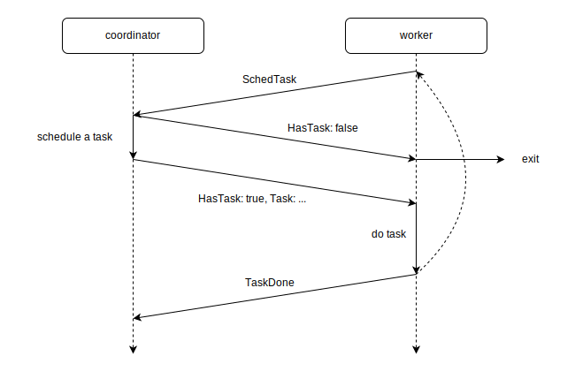
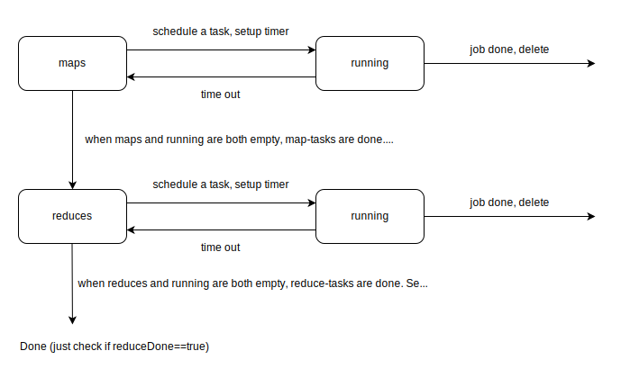

Basically just some design and summary here.

# design of RPC call
Only two RPC calls are used, `SchedTask` and `TaskDone`. `SchedTask` is used when a worker is looking for a task from the coordinator. And `TaskDone` is used when a worker finished its job and report to the coordinator.

# design of intermediate file
I just arrange the name of the intermediate files, instead of letting the map-workers report their intermediate files' name to the coordinator, in order to make things easier. The intermediate file name will just be `mr-a-b`, where `a` is the task id of map-task, and `b` is the task id of reduce-task.  
According to the lab guidance, I created a temp file during writing and move it to the final position after writing.

# design of worker
I make the worker as simple as possible. The worker should behave as a function instead of a struct. It doesn't hold any complex states. And it should not deal with any concurrency (i.e. no lock inside worker).  
The main part of worker is just a loop. The loop will exit when `SchedTask` shows there are no left tasks. And keep running if any task is scheduled or the `SchedTask` is blocked, which means waiting for something to be done (such as some map tasks).  
And workers will just call the `mapf` or `reducef` and do their job. This part doesn't need to be locked, it's just sequential.  
The whole process can be expressed as: 

# design of coordinator
The coordinator should take the part of concurrency and data race, thus need a mutex. I use only one mutex to protect the whole coordinator.  
On init, the coordinator should read all filename, and generate a list of map-task and a list of reduce-task. And it also needs a queue to store the running tasks, so we can check if any task is not successfully completed and put it back to the task list.  
For convenient, I also add two bool, `mapDone` and `reduceDone`. So finally the `Coordinator` will be like:  
```go
type Coordinator struct {
	maps       []Task
	reduces    []Task
	running    map[int]Task
	mapDone    bool
	reduceDone bool
	m          sync.Mutex
}
```
I use go routine to achieve crash recovering. As the coordinator schedules a task to a worker, it will also start a routine to sleep for 10 seconds. Then the routine will get the lock, check if the task is still in `running` queue, which means the task is still not done by workers. If so, lock and move the task from `running` back to `maps` or `reduces` so it can be scheduled again.  
The schedule can be expressed as below: 


[return to index](./index)